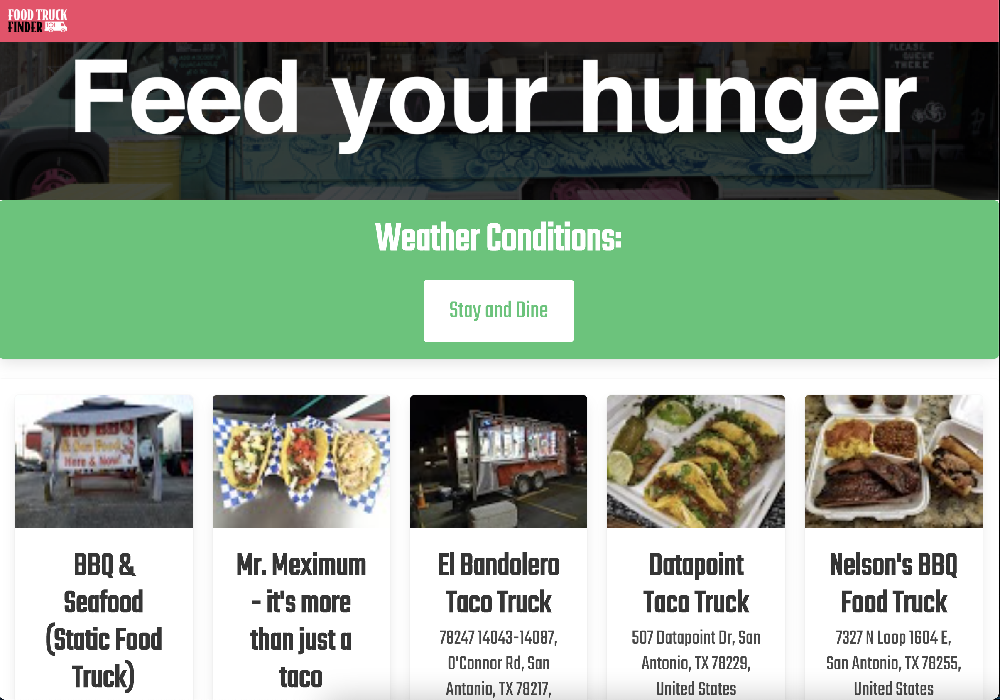

# Food-Truck-Finder

## Description

An application designed to allow users to easily search for nearby food trucks using the current location.

## What the project does

The project allows users to find nearby food trucks using the current location. When users navigate to the website, it'll ask for permission to use the current location and upon approval from the user, the application will return ten options for nearby food trucks. Below is a screenshot of the landing page.

## Why is the project useful

The project is an easy way for users to find a food truck. When users are on the go, all they have to do is pull up their Food-Truck-Finder app, authrize it to use their location, and they'll have available food trucks in seconds.

## How users can get started with the project

Simply navigate to the deployed version listed below to interact with it.

https://chavalk.github.io/Food-Truck-Finder/

## What technologies were used with the project

* Google Places API
* Open Weather API
* Bulma CSS Framework
* HTML5
* CSS3
* JavaScript
* jQuery
* GitHub Pages

## Where users can get help with your project

This is the GitHub username for each of the contributors: CalebTheCreative, luismvela1, Agarc4777, and chavalk.

These are the links for our GitHub profiles:

https://github.com/CalebTheCreative

https://github.com/luismvela1

https://github.com/Agarc4777

https://github.com/chavalk

If you have any additional questions, feel free to reach any of us at:

calebhopkins@outlook.com

luismvela1@gmail.com

chavalk@hotmail.com

## Who maintains and contributes to the project

Currently I'm the only person maintaining and contributing to this forked repository of the project.